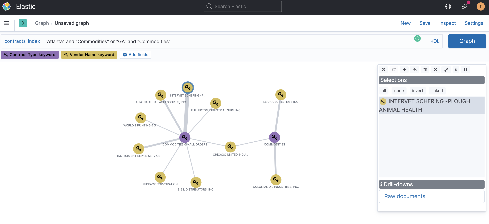
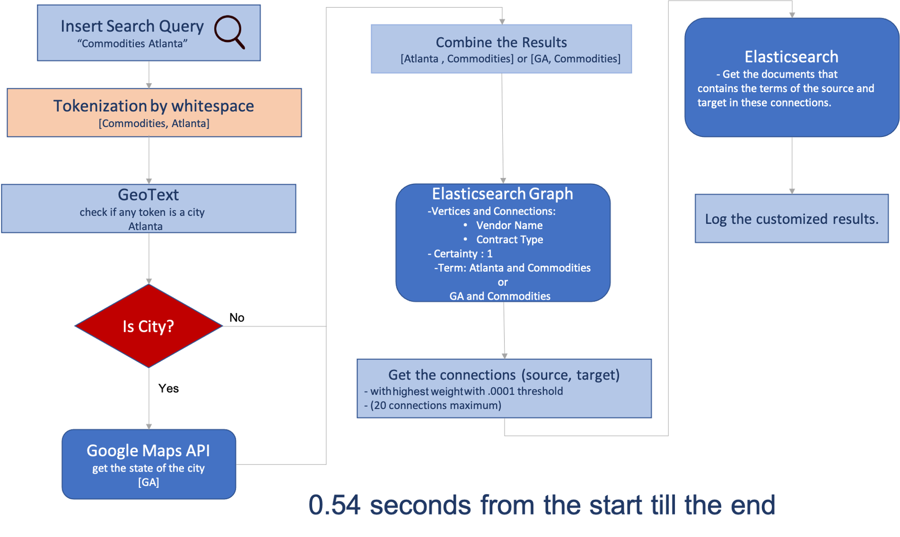

# Harbour Sample Project
**Project Simple User Interface Demo**

**Elasticsearch Graph Demo** Click on the image for the demo
[](https://drive.google.com/file/d/17mCO_9gDyRCpuSnpDejOeSGtkOwdGZtE/view?usp=sharing)

# Dataset
**Dataset:** https://www.chicago.gov/city/en/dataset/contracts.html <br>
**Description:** Contracts and modifications awarded by the City of Chicago from 1993 to present.

# Technologies
  <ol>
    <li><a href="https://www.elastic.co/elasticsearch">Elasticsearch</a></li>
    <li><a href="https://www.elastic.co/what-is/elasticsearch-graph">Elasticsearch Graph</a></li>
    <li><a href="https://www.python.org/">Python3</a></li>
    <li><a href="https://github.com/googlemaps/google-maps-services-python">Google Maps API</a></li>
    <li><a href="https://learn.hashicorp.com/vault">Vault</a></li>
  </ol>

# Prerequisites
1- Install dependencies.
   ```sh
   pip install requirements.txt 
   ```
2- Elasticsearch credentials and Google maps API key are stored in Vault, request access to run the project.

# The Architecture

